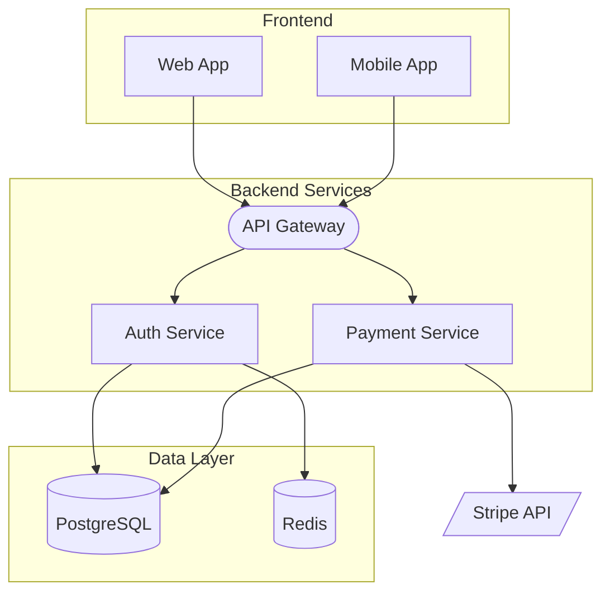

# Template: Architecture Diagram

**Type**: `architecture`
**Directive**: `flowchart TD`

## When to Use

- System architecture, component diagrams, service maps
- C4-like views using flowchart + subgraphs
- Infrastructure and deployment topologies

## Node Conventions

| Shape | Syntax | Usage |
|-------|--------|-------|
| Rectangle | `ID[Label]` | Services, applications |
| Cylinder | `ID[(Label)]` | Databases, data stores |
| Trapezoid | `ID[/Label/]` | External systems, third-party |
| Rounded | `ID(Label)` | Internal components |
| Stadium | `ID([Label])` | API endpoints, interfaces |

## Subgraph Conventions

Use `subgraph` to represent system boundaries and component groups:

```mermaid
subgraph "System Name"
  direction TB
  component1[Service A]
  component2[Service B]
end
```

## Link Conventions

| Style | Syntax | Usage |
|-------|--------|-------|
| Solid arrow | `-->` | Synchronous communication |
| Dotted arrow | `-.->` | Asynchronous / optional |
| Labeled arrow | `-->|protocol|` | Communication with protocol (REST, gRPC, etc.) |

## Generation Instructions

When generating an architecture diagram from a natural language description:

1. **Identify system boundaries**: Group components by domain using subgraphs
2. **Identify services**: Extract each service/component mentioned
3. **Identify data stores**: Databases, caches, queues — use cylinder nodes
4. **Identify external systems**: Third-party APIs, external services — use trapezoid nodes
5. **Map communications**: Draw links between components that interact
6. **Label protocols**: Add protocol/transport information on links where relevant
7. **Direction**: Always use TD (top-down) for architecture views

### System Boundary Conventions

- Use `subgraph` for each logical system boundary (frontend, backend, data, external)
- Name boundaries with domain context: `subgraph "Payment Domain"`
- Set direction inside subgraphs with `direction TB` or `direction LR`
- External systems should be OUTSIDE all subgraphs

### Component Type Differentiation

| Component Type | Node Shape | Example |
|----------------|------------|---------|
| Service / App | Rectangle `[Label]` | `auth[Auth Service]` |
| Database | Cylinder `[(Label)]` | `db[(PostgreSQL)]` |
| Cache / Queue | Cylinder `[(Label)]` | `cache[(Redis Cache)]` |
| External API | Trapezoid `[/Label/]` | `stripe[/Stripe API/]` |
| API Gateway | Stadium `([Label])` | `gw([API Gateway])` |
| Message Bus | Hexagon `{{Label}}` | `bus{{Event Bus}}` |

### Standard Architecture Patterns

- **API Gateway pattern**: Place gateway as single entry point between frontend and backend subgraphs
- **Microservices**: Each service in its own rectangle, connected via gateway or event bus
- **Event-driven**: Use hexagon nodes for event bus/queue, dotted arrows for async messages
- **Layered**: Organize subgraphs vertically: Presentation → Application → Domain → Infrastructure

### Communication Labels

- Label synchronous calls with protocol: `-->|REST|`, `-->|gRPC|`
- Label async channels: `-.->|events|`, `-.->|queue|`
- Use dotted arrows `-.->` for all asynchronous communication

## Example


