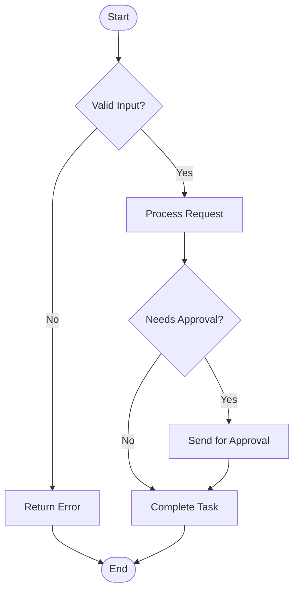

# Template: Flowchart Diagram

**Type**: `flowchart`
**Directive**: `flowchart TD` (Top-Down) or `flowchart LR` (Left-Right)

## When to Use

- Process flows, decision trees, user journeys
- Any sequential logic with branching
- TD for hierarchical/overview flows, LR for step-by-step processes

## Node Conventions

| Shape | Syntax | Usage |
|-------|--------|-------|
| Rectangle | `ID[Label]` | Actions, steps, processes |
| Diamond | `ID{Label}` | Decisions, conditions |
| Rounded | `ID(Label)` | Start/end points |
| Stadium | `ID([Label])` | Sub-processes |
| Hexagon | `ID{{Label}}` | Preparation steps |

## Link Conventions

| Style | Syntax | Usage |
|-------|--------|-------|
| Solid arrow | `-->` | Normal flow |
| Dotted arrow | `-.->` | Optional/alternative path |
| Labeled arrow | `-->|label|` | Conditional flow |
| Thick arrow | `==>` | Primary/critical path |

## Generation Instructions

When generating a flowchart from a natural language description:

1. **Identify the main flow**: Extract the primary sequence of steps
2. **Identify decisions**: Look for "if/then", "when", "depending on" — use diamond nodes
3. **Identify start/end**: Use rounded nodes for entry and exit points
4. **Group related steps**: Use `subgraph` for logical groupings
5. **Name nodes meaningfully**: Use kebab-case IDs and descriptive labels
6. **Direction choice**: Use TD for overview diagrams, LR for detailed processes

### Direction Selection Guide

| Context | Direction | Rationale |
|---------|-----------|-----------|
| Overview / hierarchical | `flowchart TD` | Top-down maps naturally to hierarchy |
| Step-by-step process | `flowchart LR` | Left-to-right reads like a timeline |
| Decision tree | `flowchart TD` | Branching flows better vertically |
| Pipeline / CI/CD | `flowchart LR` | Sequential stages read horizontally |

### Subgraph Best Practices

- Use subgraphs for **logical grouping** (not just visual separation)
- Name subgraphs with domain context: `subgraph "Authentication Phase"`
- Limit to 2 levels of nesting maximum
- Each subgraph should contain 2-6 nodes

### Styling Decision Nodes

- Always use diamond `{Label}` for true decisions (yes/no, if/else)
- Use labeled arrows for decision outcomes: `-->|Yes|` and `-->|No|`
- Place the "happy path" on the left/down, error paths on the right

### Error Path Conventions

- Use dotted links `-.->` for error and fallback paths
- Group error handling in a dedicated subgraph when complex
- Always end error paths at a defined endpoint (not dangling)
- Label error transitions clearly: `-.->|timeout|`, `-.->|invalid|`

## Example

