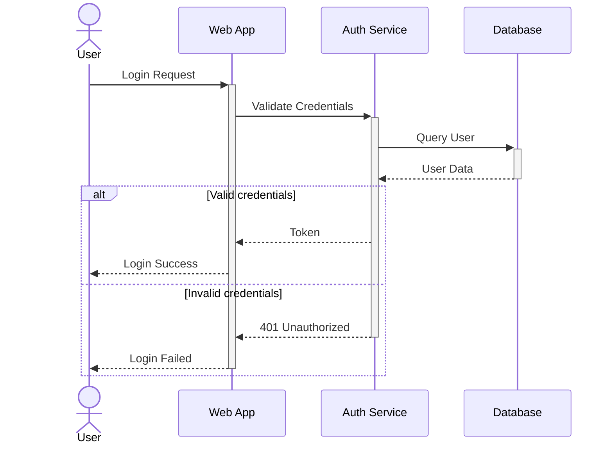

# Template: Sequence Diagram

**Type**: `sequence`
**Directive**: `sequenceDiagram`

## When to Use

- API call flows, request/response patterns
- Multi-actor interactions with timing
- Authentication flows, payment sequences

## Participant Conventions

| Syntax | Usage |
|--------|-------|
| `participant ID as Label` | Named participant with display label |
| `actor ID as Label` | Human actor (stick figure) |

## Message Conventions

| Syntax | Usage |
|--------|-------|
| `ID->>ID2: message` | Synchronous call |
| `ID-->>ID2: message` | Asynchronous call |
| `ID->>+ID2: message` | Activate target lifeline |
| `ID-->>-ID2: response` | Deactivate and respond |
| `ID-xID2: message` | Failed/lost message |

## Fragment Conventions

| Syntax | Usage |
|--------|-------|
| `alt condition` / `else` / `end` | Conditional branches |
| `opt condition` / `end` | Optional block |
| `loop condition` / `end` | Repeated block |
| `par` / `and` / `end` | Parallel execution |
| `Note over ID: text` | Note annotation |

## Generation Instructions

When generating a sequence diagram from a natural language description:

1. **Identify actors/systems**: Extract all participants in the interaction
2. **Order interactions**: Map the chronological sequence of messages
3. **Distinguish sync/async**: Use `->>` for sync, `-->>` for async calls
4. **Use activation**: Activate lifelines for processing blocks (`+`/`-`)
5. **Add conditionals**: Use `alt`/`opt` for branching logic
6. **Add error paths**: Use `alt` with error conditions
7. **Add notes**: Annotate important steps with `Note over`

### Fragment Usage Guide

| Fragment | When to Use | Example |
|----------|-------------|---------|
| `alt`/`else` | Two or more exclusive paths | Valid vs invalid credentials |
| `opt` | Something that may or may not happen | Optional cache check |
| `loop` | Repeated interaction | Retry on failure |
| `par`/`and` | Concurrent operations | Parallel API calls |
| `critical` | Must complete atomically | Transaction commit |
| `break` | Exit the enclosing fragment | Early return on error |

### Sync vs Async Conventions

| Pattern | Arrow | Return | Usage |
|---------|-------|--------|-------|
| Synchronous call | `->>` | `-->>` | HTTP request/response |
| Async fire-and-forget | `-->>` | none | Event publish |
| Async with callback | `-->>` | `-->>` | Webhook, message queue |
| Failed message | `-x` | none | Timeout, network error |

### Activation / Lifeline Best Practices

- **Activate** a participant when it starts processing: `A->>+B: request`
- **Deactivate** when it returns: `B-->>-A: response`
- Keep activations balanced (every `+` has a matching `-`)
- Use activations to show which participant is "working" at any point

### Error Handling Patterns

Always include error paths for critical operations:

```mermaid
alt Success
  B-->>A: 200 OK
else Timeout
  B-xA: Request Timeout
  A->>A: Retry Logic
else Server Error
  B-->>A: 500 Error
  A->>C: Log Error
end
```

- Place the happy path first in `alt` blocks
- Use `break` to exit early on fatal errors
- Add `Note over` to explain error recovery strategies

## Example


