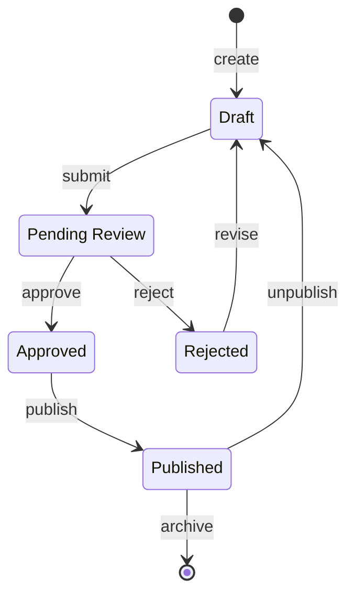

# Template: State Diagram

**Type**: `state`
**Directive**: `stateDiagram-v2`

## When to Use

- Object lifecycle management (orders, sessions, tickets)
- Workflow states and transitions
- Protocol state machines

## State Conventions

| Syntax | Usage |
|--------|-------|
| `state "Label" as ID` | Named state with readable label |
| `[*] --> ID` | Initial state transition |
| `ID --> [*]` | Final state transition |
| `state ID { ... }` | Composite/nested state |

## Transition Conventions

| Syntax | Usage |
|--------|-------|
| `ID --> ID2 : event` | State transition with event trigger |
| `ID --> ID2 : event [guard]` | Guarded transition |
| `ID --> ID2 : event / action` | Transition with side effect |

## Generation Instructions

When generating a state diagram from a natural language description:

1. **Identify states**: Extract all distinct states an entity can be in
2. **Identify transitions**: Map events that cause state changes
3. **Identify initial state**: Use `[*] -->` for the entry point
4. **Identify final states**: Use `--> [*]` for terminal states
5. **Name states clearly**: Use `state "Human Label" as kebab-id`
6. **Add guard conditions**: If transitions are conditional, add `[guard]`
7. **Group related states**: Use composite states for complex sub-flows

### Composite State Conventions

Use composite states to group related sub-states:

```mermaid
state "Processing" as processing {
  [*] --> validating
  validating --> executing : valid
  executing --> [*] : done
}
```

- Use composites when a state has its own internal lifecycle
- Limit nesting to 2 levels (composite inside composite is the max)
- Entry transitions flow into `[*]` inside the composite

### Entry/Exit Actions

Document side effects on transitions using the `/action` notation:

```
idle --> active : start / initialize_timer
active --> idle : timeout / cleanup_resources
```

- Place actions after `/` on transitions
- Keep action names short and descriptive (verb_noun format)

### Guard Conditions

Document conditions that must be true for a transition to fire:

```
pending --> approved : review [all_checks_pass]
pending --> rejected : review [has_blocking_issue]
```

- Guards go in `[brackets]` after the event name
- Use snake_case for guard condition names
- Each guard should be testable/verifiable

### Fork/Join for Parallel States

When an entity enters multiple concurrent states:

```mermaid
state fork_state <<fork>>
state join_state <<join>>
processing --> fork_state
fork_state --> validating
fork_state --> logging
validating --> join_state
logging --> join_state
join_state --> complete
```

- Use `<<fork>>` and `<<join>>` for parallel state regions
- All forked paths must rejoin before proceeding

## Example


